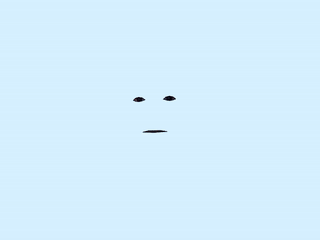

# Face and mouth tracking demo

Basic demo of clmtrackr.js to track face features, with p5.js for rendering and interactivity based on mouth tracking. 

[Live webcam demo](https://olwal.github.io/expression)
